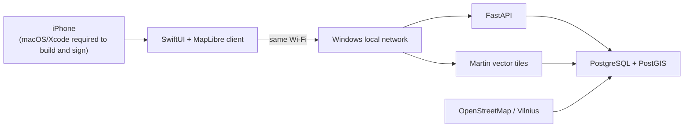

# Map

Map is an AI-native geographic marketplace concept for local services. Existing map products often
stop at discovery; Map's intended future flow is **need → discovery → comparison → availability →
action/booking**. Those marketplace and AI capabilities are future work, not current functionality.

## Current status

Milestone 1 is a Vilnius-only local prototype. It currently provides:

- a Windows-first Docker Compose environment;
- PostgreSQL with PostGIS and a persistent volume;
- a small FastAPI service with health, Vilnius configuration, and MapLibre style endpoints;
- Martin serving locally controlled vector tiles from PostGIS;
- a reproducible Lithuania-to-Vilnius OSM clipping script;
- native SwiftUI and MapLibre iOS source;
- backend tests and minimal CI.

Primary development is Windows 11. The initial consumer client is iOS. Its source is maintained here,
but native compilation, signing, simulation, and device installation require macOS and Xcode.

## Architecture



The API binds to the laptop's LAN interface. For a physical iPhone, configure the Windows LAN IP;
`localhost` on the phone means the phone itself.

## Setup on Windows

Prerequisites: Git, PowerShell 5.1+ or PowerShell 7, and a running Docker Desktop.

```powershell
git clone https://github.com/Umar3331/Map.git map-platform
cd map-platform
Copy-Item .env.example .env
.\scripts\setup.ps1
.\scripts\start.ps1
.\scripts\health.ps1
```

Open `http://localhost:8000/docs`, or stop the stack with `./scripts/stop.ps1`. See
[Windows setup](docs/WINDOWS_SETUP.md) and [local development](docs/LOCAL_DEVELOPMENT.md).

## Repository

- `apps/ios` — SwiftUI/MapLibre source and XcodeGen specification
- `services/api` — FastAPI application and tests
- `infrastructure/local` — database initialization
- `scripts` — PowerShell workflows and map-data preparation
- `docs` — product, architecture, decisions, roadmap, and setup guidance
- `data` — ignored local inputs and generated geographic artifacts

## Future direction

Geography: **Vilnius → Lithuania → Baltics → Europe**.

Capability sequence: **map → places → services → search → availability → booking → routing → AI**.
None beyond the current mapping foundation should be inferred as implemented.

## Licensing and attribution

Project source licensing has not yet been selected; all rights are reserved until an explicit
`LICENSE` is added. OpenStreetMap data is © OpenStreetMap contributors and licensed under ODbL.
MapLibre components retain their respective upstream licenses.
