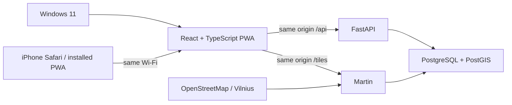

# Map

Map is an evolving location-based platform intended eventually to connect people with real local
services. The long-term flow is **need → discovery → comparison → availability → action**. Today the
project is deliberately focused on its geographic foundation.

## Map v0.1 — Vilnius PWA

Milestone 1 is an installable, mobile-first map for Vilnius. It provides a React/TypeScript PWA,
MapLibre GL JS, a same-origin local gateway, FastAPI, PostgreSQL/PostGIS, and Martin vector tiles.
The map supports desktop and touch interaction, optional one-shot browser geolocation, and iPhone
Home Screen installation. Search is visibly marked as future functionality.

### Why PWA first?

Windows 11 is the primary development environment and no unrestricted Mac/Xcode machine is
available. A PWA makes the complete client build and test workflow available on Windows while
allowing iPhone installation directly from Safari. The API, PostGIS, OSM pipeline, and client-domain
work remain reusable if native clients are evaluated later. This is the first production-oriented
client architecture, not a throwaway substitute.

## Architecture



The web gateway is the only browser-facing integration point. This prevents an iPhone from receiving
incorrect `localhost` API or tile URLs. Postgres and Martin are published only on Windows loopback;
only the web gateway ports are intentionally reachable on the LAN during local development.

## Run on Windows

Prerequisites are Git, PowerShell, and a running Docker Desktop:

```powershell
git clone https://github.com/Umar3331/Map.git
cd Map
Copy-Item .env.example .env
.\scripts\setup.ps1
.\scripts\start.ps1
.\scripts\health.ps1
```

Open `http://localhost:5173`. The start script also prints the active LAN URL and optional HTTPS PWA
URL. Stop with `.\scripts\stop.ps1`. See [Windows setup](docs/WINDOWS_SETUP.md),
[local development](docs/LOCAL_DEVELOPMENT.md), and [iPhone installation](docs/IPHONE_INSTALLATION.md).
Milestone 1 merge acceptance is tracked in [the acceptance checklist](docs/ACCEPTANCE.md).

## Map-data status

The seeded Vilnius boundary vector layer is local and self-hosted through PostGIS and Martin. The
detailed visual basemap currently uses OpenStreetMap's public raster tile server as a **TEMPORARY
DEVELOPMENT DEPENDENCY**. The target remains filtered Vilnius OSM data served locally; large source
extracts and generated artifacts are ignored by Git. OSM attribution remains visible.

The immediate next milestone is **Milestone 1.1 — Fully self-hosted Vilnius basemap**. It will replace
the public raster dependency; this PR intentionally does not implement that work.

## Repository

- `apps/web` — active React/TypeScript/MapLibre PWA
- `services/api` — FastAPI and tests
- `infrastructure/local` — PostGIS initialization
- `scripts` — Windows-first workflow and map-data preparation
- `archive/ios-prototype` — preserved, inactive SwiftUI experiment
- `docs` — product, architecture, decisions, roadmap, and operating guides

Project source licensing has not yet been selected. OpenStreetMap data is © OpenStreetMap
contributors under ODbL; dependencies retain their upstream licenses.
