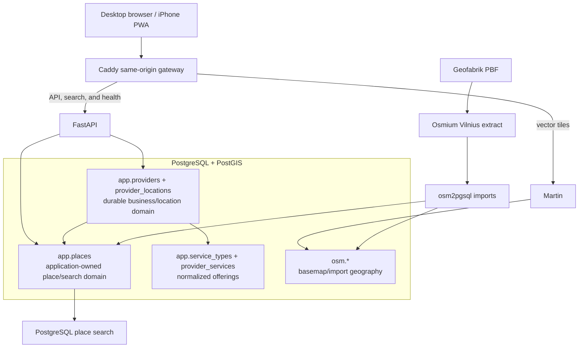

# Map

Map is a local-first location and services discovery platform currently focused on Vilnius. Its
implemented flow is **map → browse places → search/discovery → place details → provider/services**. The longer-term
direction is **need → discovery → provider/service comparison → availability → booking/action**;
provider comparison, availability, and booking are not implemented yet.

## Current capabilities

- Installable React/TypeScript PWA validated on desktop and a physical iPhone.
- Trusted local HTTPS and a fully self-hosted Vilnius vector basemap backed by local OSM/PostGIS data.
- 4,724 application-owned places with category-aware browsing, clustering, and responsive details.
- Local PostgreSQL-backed exact, prefix, fuzzy, category-intent, and controlled service-intent search.
- Search-result map mode that focuses discovery while preserving normal place browsing when cleared.
- Provider profiles with physical locations, normalized service offerings, and source provenance.
- Fully local runtime after the source data has been downloaded and imported.

## Project status

- **Complete:** Milestone 1 (Vilnius PWA foundation), Milestone 1.1 (self-hosted basemap), Milestone 2
  (places/local businesses), and Milestone 3 (search/discovery).
- **In progress:** Milestone 4 — service-provider profiles. Windows production-browser acceptance is
  complete; physical-iPhone acceptance remains outstanding.

See the [full roadmap](docs/ROADMAP.md) for the remaining direction and sequencing.

## Why the PWA architecture?

Windows 11 is the primary development environment and no unrestricted Mac/Xcode machine is
available. A PWA makes the complete client build and test workflow available on Windows while
allowing iPhone installation directly from Safari. The API, PostGIS, OSM pipeline, and client-domain
work remain reusable if native clients are evaluated later. This is the first production-oriented
client architecture, not a throwaway substitute.

## Architecture



The web gateway is the only browser-facing integration point. This prevents an iPhone from receiving
incorrect `localhost` API or tile URLs. Postgres and Martin are published only on Windows loopback;
only the web gateway ports are intentionally reachable on the LAN during local development.

## Run on Windows

Prerequisites are Git, PowerShell, and a running Docker Desktop:

```powershell
git clone https://github.com/Umar3331/Map.git
cd Map
Copy-Item .env.example .env
.\scripts\setup.ps1
.\scripts\map-data.ps1
.\scripts\places-data.ps1
.\scripts\provider-data.ps1
.\scripts\start.ps1
.\scripts\health.ps1
```

Open `http://localhost:5173`. The start script also prints the active LAN URL and optional HTTPS PWA
URL. Stop with `.\scripts\stop.ps1`. See [Windows setup](docs/WINDOWS_SETUP.md),
[local development](docs/LOCAL_DEVELOPMENT.md), and [iPhone installation](docs/IPHONE_INSTALLATION.md).
Place browsing and search are available after `.\scripts\places-data.ps1` completes. Provider and
service profiles are seeded by `.\scripts\provider-data.ps1`. Acceptance for Milestones 1 through 3
and the current Milestone 4 gate are recorded in
[the acceptance checklist](docs/ACCEPTANCE.md).

## Self-hosted Vilnius map data

`scripts/map-data.ps1` downloads Geofabrik's Lithuania PBF when it is missing, validates it, extracts
a buffered Vilnius bounding box with Osmium, and imports a curated vector schema with osm2pgsql. The
PBF download is an update-time dependency only. At runtime, MapLibre requests roads, buildings,
water, landuse, rail, boundaries, waterways, and place labels from Martin through same-origin
`/tiles/*` routes. No public basemap, glyph, sprite, or CDN request is required. All PBFs and generated
data remain local and ignored by Git; OpenStreetMap attribution remains visible.

## Vilnius places

Milestone 2 introduces Map-owned `app.places` entities seeded from a curated subset of named OSM
points of interest. Run `scripts/places-data.ps1` after `map-data.ps1`; repeated runs upsert by stable
OSM source ID and do not duplicate records. The PWA requests only the current viewport from
`/api/v1/places`, renders category-aware clustered MapLibre layers, and opens a responsive details
card when a place is selected. Viewport responses report returned and total counts. When a broad
view exceeds the limit, Map hides the incomplete client-side clusters and asks the user to zoom in.
See [place data and provenance](docs/PLACES_DATA.md).

## Vilnius search and discovery

Milestone 3 makes place and category discovery query the trusted `app.places` catalogue through the
local FastAPI/PostgreSQL stack. Milestone 4 adds a small controlled alias map for service discovery
through normalized provider offerings. Search supports exact, prefix, partial, and lightweight
typo-tolerant names; taxonomy categories; and service terms such as `car repair`, `haircut`, and
`spa`. Specific brand queries retain name-first ranking. While results are active, a dedicated
MapLibre source replaces unrelated viewport POIs so
the map shows the search context. Selecting a result moves the map to zoom 16 and reuses the existing
place-details card or mobile bottom sheet. See
[search architecture and behavior](docs/SEARCH.md).

## Vilnius providers and services

Milestone 4 keeps geographic places separate from durable provider identities and normalized service
offerings. The repeatable local seed conservatively creates one provider for each eligible
service-oriented OSM place, links it through `app.provider_locations`, and assigns only curated
taxonomy-backed services. Place details show a compact provider summary; opening it reuses the
responsive desktop card/mobile bottom sheet for profile, service, location, and provenance data.
No prices, durations, availability, booking, claims, or provider accounts are inferred. See
[provider data and behavior](docs/PROVIDERS.md).

## Repository

- `apps/web` — active React/TypeScript/MapLibre PWA
- `services/api` — FastAPI and tests
- `infrastructure/local` — PostGIS initialization
- `scripts` — Windows-first workflow and map-data preparation
- `archive/ios-prototype` — preserved, inactive SwiftUI experiment
- `docs` — product, architecture, decisions, roadmap, and operating guides

## Documentation

- [Architecture](docs/ARCHITECTURE.md)
- [Roadmap](docs/ROADMAP.md)
- [Acceptance](docs/ACCEPTANCE.md)
- [Place data and provenance](docs/PLACES_DATA.md)
- [Search](docs/SEARCH.md)
- [Providers and services](docs/PROVIDERS.md)
- [Local development](docs/LOCAL_DEVELOPMENT.md)
- [iPhone installation](docs/IPHONE_INSTALLATION.md)

Project source licensing has not yet been selected. OpenStreetMap data is © OpenStreetMap
contributors under ODbL; dependencies retain their upstream licenses.
